# Job Board

A modern, full-stack job board application built with React, Tailwind CSS, and Laravel. This platform allows users to browse job listings, apply for positions, and manage their applications, while employers can post and manage job openings.

## Live Deployment

The application is deployed and accessible at: https://job-board-frontend-two-sigma.vercel.app/

### Deployment Stack

- **Frontend:** Vercel (React application)
- **Backend:** Render (Laravel API with Docker containerisation)
- **Database:** PostgreSQL (hosted on Render)

## Important Notes for Live Site

### ⏱️ Initial Load Time

The backend uses Render's free tier, which spins down after periods of inactivity. On your first visit or after inactivity, the backend may take 30-60 seconds to wake up. Subsequent requests will be much faster.

### ⚠️ Known Limitations in Deployed Version

Due to hosting constraints on the current deployment setup (Vercel + Render free tier), the following features are disabled in the live version:

- **Resume Downloads** – Employers cannot download applicant resumes.
- **Email Notifications** – Application and status update emails are disabled.

These features work fully in a local environment.

### ✅ Full Feature Access

Both resume downloads and email notifications work perfectly in local environments. To explore these features:

1. Clone the repository.
2. Check out either the `sessions-auth-backup` or `jwt-auth` branches.

These branches contain the complete, fully-functional implementation including file downloads and email notifications.

## Features

### For Job Seekers

- 🔐 User registration and authentication
- 📝 Create and manage profile with resume upload
- 🔍 Browse and filter job listings
- 📌 Apply for jobs
- 📊 Track application status
- 💼 View detailed job information
- 📧 Email notifications for application status updates

### For Employers

- 💼 Employer profile setup
- ✍️ Post and manage job listings
- 📋 View applications for posted jobs
- ✏️ Edit job postings
- 🔒 Close job listings
- 📄 Download and view applicant resumes

### General

- 🎨 Clean, responsive UI with Tailwind CSS
- 🔒 Secure authentication with Laravel Sanctum
- 📱 Mobile-first responsive design approach
- ⚡ Fast and efficient API
- 🛡 JWT-based authentication with Laravel Sanctum

## Screenshots

### 🔍 Job Seeker Experience

#### 🏠 Homepage

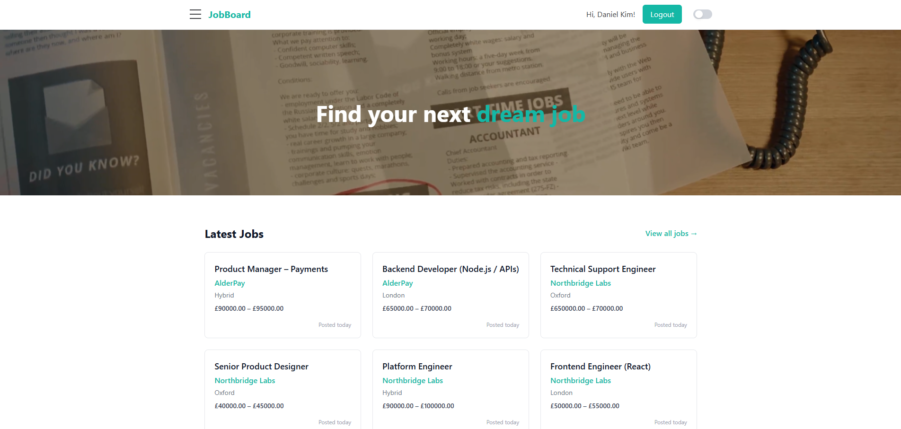

#### 🔍 Filter Jobs

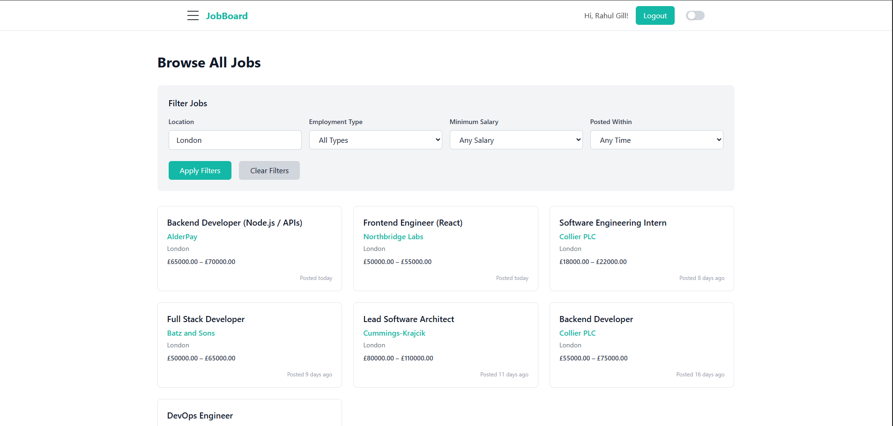

#### 💼 Job Details Page

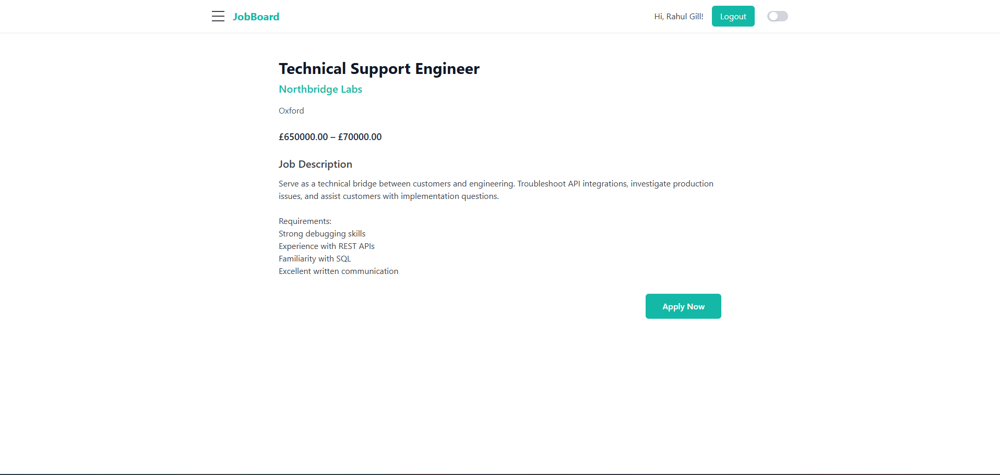

#### 📌 Apply to Job (Modal)

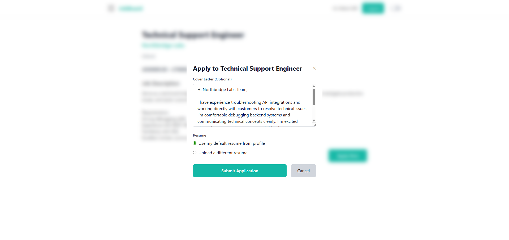

#### 📊 Track Applications

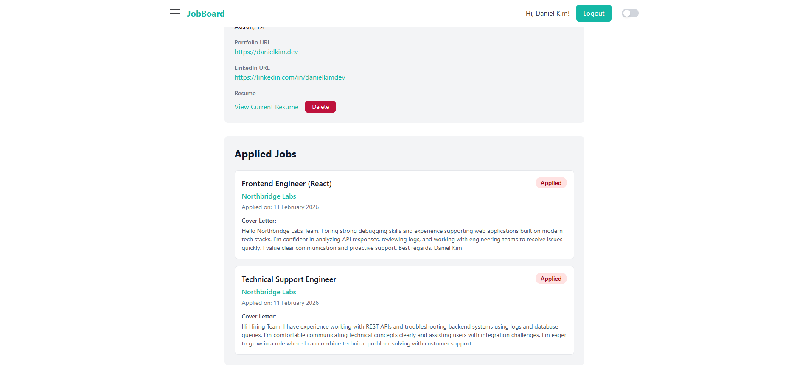

#### 👤 Profile Page

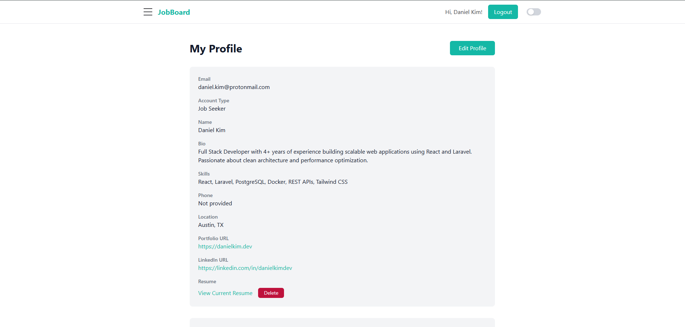

### 🏢 Company Admin Experience

#### 🏠 Admin Dashboard

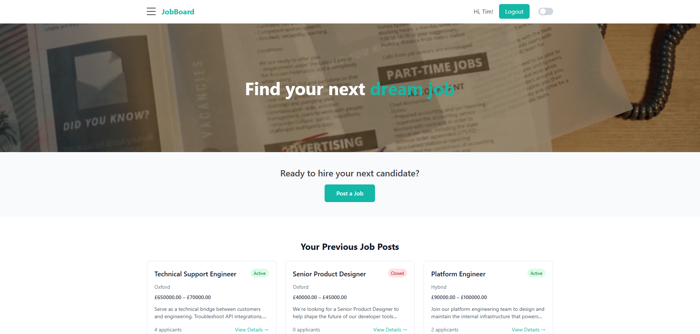

#### 📂 Previous Job Postings

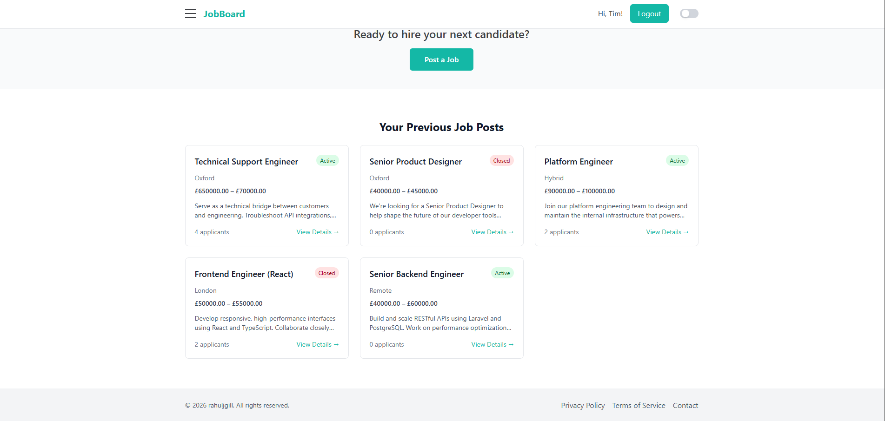

#### 📋 View Applicants

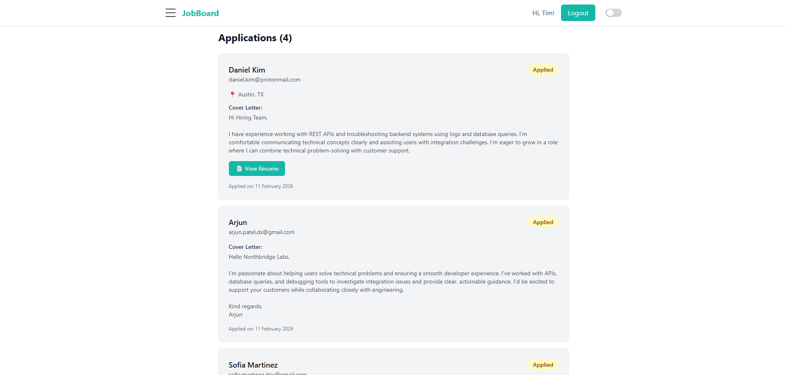

#### ✏️ Job Actions (Edit / Close)

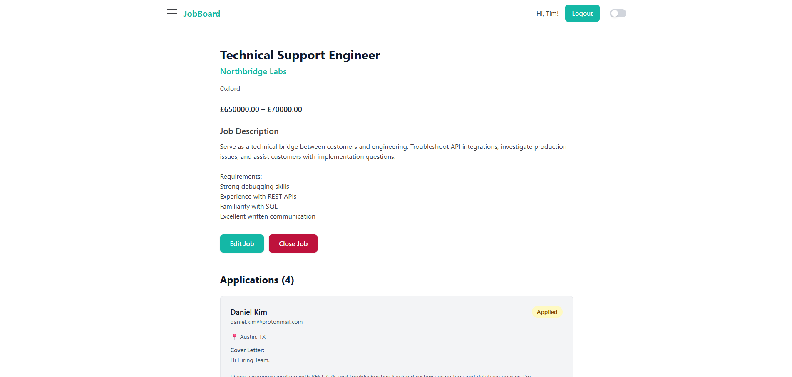

#### 🏢 Company Profile

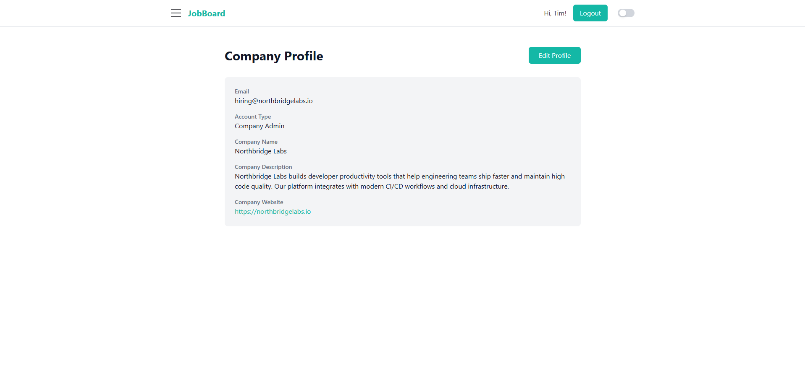

## Architecture & Design

- Backend follows the MVC (Model–View–Controller) pattern using Laravel
- API is designed using RESTful principles
- Frontend and backend are fully decoupled
- Authentication handled via JWT-based auth with Laravel Sanctum
- Role-based access control for job seekers and employers

## Tech Stack

### Frontend

- React
- React Router
- Tailwind CSS
- Vite

### Backend

- Laravel
- Laravel Sanctum
- PHP
- Eloquent ORM
- RESTful API architecture
- MVC design pattern

### Database

- SQL-based (configurable - MySQL, PostgreSQL, SQLite)
- Migrations and seeders included

## Project Structure

```
jobBoard/
├── frontend/                 # React application
│   ├── src/
│   │   ├── pages/           # Page components
│   │   ├── components/      # Reusable components
│   │   ├── context/         # React context for state
│   │   └── utils/           # Utility functions
│   ├── package.json
│   ├── vite.config.js
│   └── tailwind.config.js
├── backend/                  # Laravel application
│   ├── app/
│   │   ├── Http/
│   │   │   ├── Controllers/ # API controllers
│   │   │   └── Middleware/  # HTTP middleware
│   │   └── Models/          # Eloquent models
│   ├── routes/
│   │   └── api.php          # API routes
│   ├── database/
│   │   ├── migrations/      # Database migrations
│   │   ├── factories/       # Model factories
│   │   └── seeders/         # Database seeders
│   ├── config/              # Configuration files
│   └── composer.json
├── package.json             # Root package.json
└── README.md
```

## API Documentation

All API endpoints are prefixed with `/api/` and require authentication via Laravel Sanctum (except login/register).

### Authentication

- `POST /api/register` - Register a new user
- `POST /api/login` - Login user
- `POST /api/logout` - Logout user (requires auth)
- `GET /api/user` - Get authenticated user (requires auth)

### Jobs

- `GET /api/jobs` - List all job listings
- `GET /api/jobs/{id}` - Get job details
- `POST /api/jobs` - Create new job (employer, requires auth)
- `GET /api/my-jobs` - Get jobs posted by current user (requires auth)
- `PUT /api/jobs/{id}` - Update job (requires auth)
- `PATCH /api/jobs/{id}/close` - Close a job listing (requires auth)

### Applications

- `GET /api/applications` - Get user's applications (requires auth)
- `POST /api/applications` - Submit job application (requires auth)
- `GET /api/applications/check/{jobId}` - Check if user applied (requires auth)
- `GET /api/jobs/{jobId}/applications` - Get applications for a job (employer, requires auth)

### User Profile

- `GET /api/me` - Get current user profile (requires auth)
- `POST /api/profile` - Update user profile (requires auth)
- `DELETE /api/profile/resume` - Delete user resume (requires auth)

### Employer Profile

- `POST /api/employer/profile` - Update employer profile (requires auth)

## Database

### Models

- **User** - Job seeker and employer accounts
- **Job** - Job listings
- **Application** - Job applications submitted by users
- **Company** - Employer company information

## Why This Project?

This job board was built to simulate a real-world, production-style web application rather than a simple CRUD demo. I chose this project because it naturally involves many challenges that appear in real products, including:

- Role-based access control (job seekers vs employers)
- Secure authentication using JWT-based auth (Laravel Sanctum)
- File uploads (CVs/resumes)
- Relational data modeling (users, companies, jobs, applications)
- Protected routes on both the frontend and backend
- Real user flows (applying to jobs, managing listings, tracking applications)

The goal was to design and implement a system that mirrors how modern job platforms work, while demonstrating full-stack skills across frontend architecture, backend APIs, authentication, and database relationships.

## Future Improvements

If I were to continue developing this project, I would focus on features that improve scalability, user experience, and realism:

- **Advanced search & filtering** - Add filtering by location, salary range, job type, and keywords.
- **Email & notification system** - Expand email notifications and introduce in-app notifications for application updates.
- **Messaging between employers and applicants** - Allow employers to contact applicants directly through the platform without exposing emails.
- **Saved jobs & alerts** - Let job seekers save jobs and receive alerts for new postings that match their interests.
- **Admin dashboard** - Add an admin role to manage users, companies, and job listings across the platform.
- **Performance & scalability** - Introduce pagination, caching, and background jobs (queues) for emails and file processing.

## License

This project is open source and available under the MIT License.
